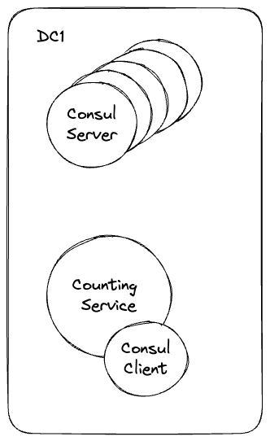

# Consul DC Testing

This repository is dedicated to testing various datacenter (DC) topologies using Consul. The goal is to explore different network configurations and their impact on service communication across multiple datacenters.

## Standard Topology

In this topology, we have one datacenter, DC1, which contains:

- 5 Consul servers
- 5 instances of a counting service with a Consul client

This configuration serves as the baseline for our testing. Future tests will involve introducing network policies to enforce segmentation and evaluating how network isolation affects communication between services.



### Running the Standard Topology

To deploy the standard topology, use the following command:

```bash
kubectl apply -f 1-Standard
```

### Accessing Services

To access the Consul server, use:

```bash
kubectl -n consul-dc1 port-forward services/consul 8500:8500
```

To access the counting service, use:

```bash
kubectl -n consul-dc1 port-forward services/counting-service 9001:9001
```

### Scaling Services

To scale the number of Consul clients up or down:

```bash
# Scale up to 10 replicas
kubectl -n consul-dc1 scale deployment consul-client --replicas 10

# Scale down to 3 replicas
kubectl -n consul-dc1 scale deployment consul-client --replicas 3
```

### Cleaning Up

To remove the deployed resources:

```bash
kubectl delete -f 1-Standard
```

---

## Further Reading

* [Consul Architecture](https://developer.hashicorp.com/consul/docs/architecture)
* [Bootstrap a Datacenter](https://developer.hashicorp.com/consul/docs/install/bootstrapping)
* [Federate Multiple Datacenters with WAN Gossip](https://developer.hashicorp.com/consul/tutorials/archive/federation-gossip-wan)
* [Consul Enterprise Admin Partitions](https://developer.hashicorp.com/consul/docs/enterprise/admin-partitions)
* [Cluster Peering Overview](https://developer.hashicorp.com/consul/docs/connect/cluster-peering)
* [Federate Multiple Datacenters with Network Areas](https://developer.hashicorp.com/consul/tutorials/archive/federation-network-areas)
* [Connect Services Across Datacenters with Mesh Gateways](https://developer.hashicorp.com/consul/tutorials/archive/service-mesh-gateways)
* [Disaster Recovery for Federated Primary Datacenter](https://developer.hashicorp.com/consul/tutorials/operate-consul/recovery-outage-primary)