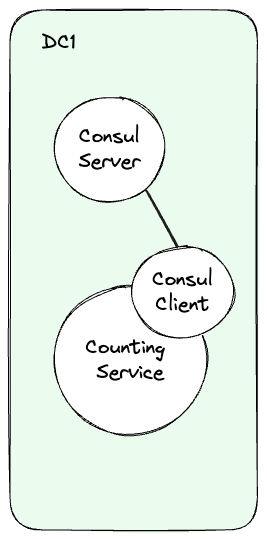

# Consul DC Testing

This repository is dedicated to testing various datacenter (DC) topographies using Consul. The goal is to explore different network configurations and their impact on service communication across multiple datacenters.

## OSS Standard Topography

In this topography, we have 1 datacenter, DC1, this containes 5x Consul servers plus 5x serverses running couinting service with a consul client. 

This configuration serves as the baseline for our testing. Future tests will involve introducing network policies to enforce segmentation and test how network isolation affects communication between services.



### To run
```bash
kubectl apply -f 1-Standard
```

### To Access

Consul Server
```bash
kubectl -n consul-dc1 port-forward services/consul 8500:8500
```

Counting Service
```bash
kubectl -n consul-dc1 port-forward services/counting-service 9001:9001
```

### To Sacle up and down
```bash
kubectl -n consul-dc1 scale deployment consul-client --replicas 10
kubectl -n consul-dc1 scale deployment consul-client --replicas 3
```

## To Cleanup
```bash
kubectl delete -f 1-Standard
```

---
## Further Reading
* [Consul Architecture](https://developer.hashicorp.com/consul/docs/architecture)
* [Bootstrap a Datacenter](https://developer.hashicorp.com/consul/docs/install/bootstrapping)
* [Federate multiple datacenters with WAN gossip](https://developer.hashicorp.com/consul/tutorials/archive/federation-gossip-wan)